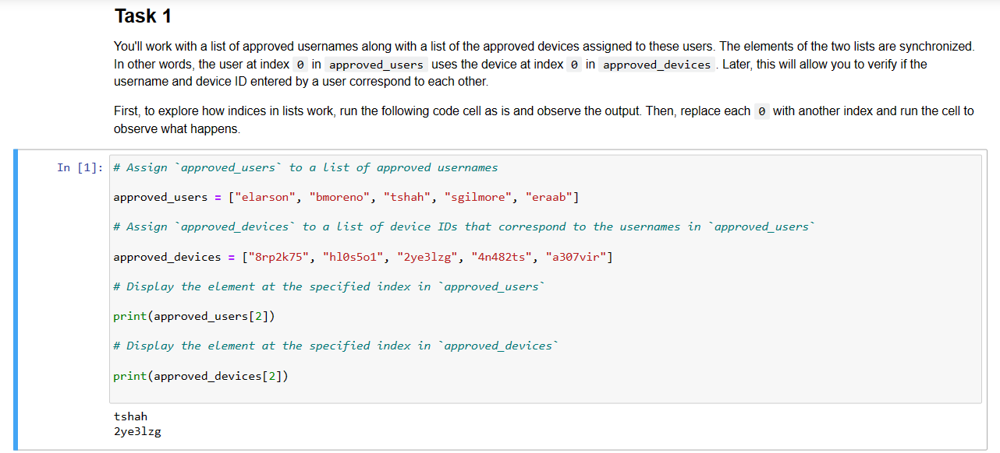

# Simple Python Algorithm
In this project, I will use a notebook environment to practice developing algorithms in Python. This project presents a security scenario to explore throughout the lab. My taks is to write an algorithm that connects users to their assigned devices.

### Scenario
In this project, you're working as a security analyst and you're responsible for developing an algorithm that connects users to their assigned devices. You'll write code that indicates if a user is approved on the system and has brought their assigned device to the security team.

## Task 1

You'll work with a list of approved usernames along with a list of the approved devices assigned to these users. The elements of the two lists are synchronized. In other words, the user at index 0 in approved_users uses the device at index 0 in approved_devices. Later, this will allow you to verify if the username and device ID entered by a user correspond to each other.

```
# Assign `approved_users` to a list of approved usernames

approved_users = ["elarson", "bmoreno", "tshah", "sgilmore", "eraab"]

# Assign `approved_devices` to a list of device IDs that correspond to the usernames in `approved_users`

approved_devices = ["8rp2k75", "hl0s5o1", "2ye3lzg", "4n482ts", "a307vir"]

# Display the element at the specified index in `approved_users`

print(approved_users[2])

# Display the element at the specified index in `approved_devices`

print(approved_devices[2])

```


